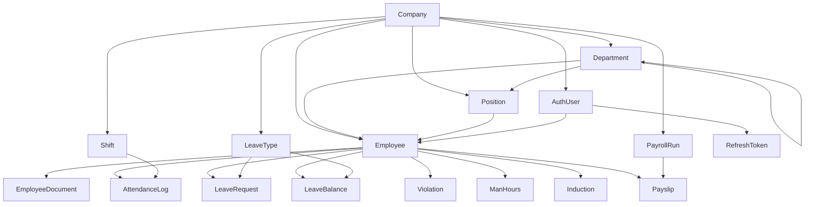

# Database Schema — Nexus HR

**Version**: 1.2 | **Date**: July 2026 | **Status**: Active Development

> Derived from `db-rules.md`, `core-build-order.md`, `api-design.md`, and `code-writing-rules.md`.

---

## 1. Design Principles

- **All primary keys are UUID v4** — never auto-increment integers
- **All tenant-scoped tables inherit `TenantModel`** with `company` FK + `TenantManager`
- **Money fields**: `DecimalField(max_digits=14, decimal_places=2)` — never FloatField
- **Optional strings**: `CharField(blank=True, default="")` — never `null=True`
- **Soft delete**: `SoftDeleteMixin` on all tenant-scoped models — `is_active` + `deleted_at`
- **Table naming**: `{app_prefix}_{model_snake_case}` (e.g., `core_employee`, `attendance_log`)
- **All timestamps in UTC** — display conversion in serializer/client

---

## 2. Tables

### Platform-Level Tables (No TenantModel)

#### `core_company`

The tenant boundary. Everything else is a child of Company.

| Field | Type | Notes |
|-------|------|-------|
| `id` | UUID PK | |
| `name` | CharField(255) | Company name |
| `industry` | CharField (choices) | `manufacturing`, `construction`, `mining`, `office` |
| `subscription_tier` | CharField | Denormalized from SubscriptionPlan |
| `is_active` | BooleanField | Soft disable |
| `geofence_lat` | DecimalField(10,7) | nullable |
| `geofence_lng` | DecimalField(10,7) | nullable |
| `geofence_radius_m` | IntegerField | nullable, meters |
| `created_at` | DateTimeField | auto |
| `updated_at` | DateTimeField | auto |

#### `core_subscriptionplan`

| Field | Type | Notes |
|-------|------|-------|
| `id` | UUID PK | |
| `name` | CharField | Plan name |
| `has_attendance` | BooleanField | Module flag |
| `has_hse` | BooleanField | Module flag |
| `has_payroll` | BooleanField | Module flag |

#### `core_companysubscription`

| Field | Type | Notes |
|-------|------|-------|
| `id` | UUID PK | |
| `company` | FK → Company | |
| `plan` | FK → SubscriptionPlan | |
| `billing_period` | CharField | |
| `active_employee_count` | IntegerField | |

---

### Authentication Tables

#### `core_authuser`

Custom user model extending `AbstractBaseUser`. Email as login (no username).

| Field | Type | Notes |
|-------|------|-------|
| `id` | UUID PK | |
| `email` | EmailField | Unique, login field |
| `company` | FK → Company | nullable (Platform Admin has no company) |
| `role` | CharField (choices) | `platform_admin`, `hr_admin`, `manager`, `employee`, `hse_officer` |
| `is_superuser` | BooleanField | Platform Admin flag |
| `is_staff` | BooleanField | Django Admin access |
| `is_active` | BooleanField | Account active flag |
| `created_at` | DateTimeField | auto |
| `updated_at` | DateTimeField | auto |

#### `core_refreshtoken`

| Field | Type | Notes |
|-------|------|-------|
| `id` | UUID PK | |
| `user` | FK → AuthUser | |
| `token_hash` | CharField | SHA-256 hash — never store raw token |
| `expires_at` | DateTimeField | |
| `device_id` | CharField | Device identifier |
| `is_revoked` | BooleanField | Revocation flag |

**Indexes**: `(user_id, device_id)`, `(user_id, is_revoked)`

---

### Core Module Tables

#### `core_department`

| Field | Type | Notes |
|-------|------|-------|
| `id` | UUID PK | |
| `company` | FK → Company (CASCADE) | Tenant FK |
| `name` | CharField(255) | |
| `code` | CharField(20) | Unique per company (e.g., ENG, HSE, OPS) |
| `parent` | FK → Department (SET_NULL) | Self-referencing, nullable |
| `is_active` | BooleanField | Soft delete |
| `deleted_at` | DateTimeField | nullable |
| `created_at` | DateTimeField | auto |
| `updated_at` | DateTimeField | auto |

**Indexes**: `(company_id, is_active)`, `(company_id, parent_id)`
**Constraints**: `UniqueConstraint(company, code)`

#### `core_position`

| Field | Type | Notes |
|-------|------|-------|
| `id` | UUID PK | |
| `company` | FK → Company (CASCADE) | |
| `department` | FK → Department (PROTECT) | |
| `title` | CharField(255) | |
| `level` | CharField (choices) | `staff`, `supervisor`, `manager`, `senior_manager`, `director` |
| `base_salary_min` | DecimalField(14,2) | |
| `base_salary_max` | DecimalField(14,2) | |
| `is_active` | BooleanField | Soft delete |
| `deleted_at` | DateTimeField | nullable |
| `created_at` | DateTimeField | auto |
| `updated_at` | DateTimeField | auto |

**Constraints**: `CheckConstraint(base_salary_min <= base_salary_max)`

#### `core_employee`

The central entity. Every other module points here.

| Field | Type | Notes |
|-------|------|-------|
| `id` | UUID PK | |
| `company` | FK → Company (CASCADE) | |
| `department` | FK → Department (PROTECT) | |
| `position` | FK → Position (PROTECT) | |
| `user` | O2O → AuthUser (SET_NULL) | nullable — not all employees have login |
| `emp_number` | CharField(20) | Auto-generated, unique per company (NXS-0001) |
| `full_name` | CharField(255) | |
| `email` | EmailField | |
| `phone` | CharField | nullable |
| `employment_type` | CharField (choices) | `permanent`, `contract`, `outsourced`, `intern` |
| `status` | CharField (choices) | `active`, `inactive`, `resigned`, `terminated` |
| `join_date` | DateField | |
| `resign_date` | DateField | nullable |
| `tax_status` | CharField (choices) | `TK0`–`TK3`, `K0`–`K3` |
| `npwp` | CharField(20) | blank, default="" — 15-digit tax ID |
| `bpjs_tk_number` | CharField | blank — social security |
| `bpjs_kes_number` | CharField | blank — health insurance |
| `bank_account_number` | CharField | blank |
| `bank_name` | CharField | blank |
| `is_active` | BooleanField | Soft delete |
| `deleted_at` | DateTimeField | nullable |
| `created_at` | DateTimeField | auto |
| `updated_at` | DateTimeField | auto |

**Indexes**:
- `(company_id, status)`
- `(company_id, department_id)`
- `(company_id, employment_type)`

**Constraints**:
- `UniqueConstraint(company, emp_number)`
- `CheckConstraint(resign_date IS NULL OR resign_date >= join_date)`

#### `core_employeedocument`

| Field | Type | Notes |
|-------|------|-------|
| `id` | UUID PK | |
| `employee` | FK → Employee (CASCADE) | Owned data |
| `doc_type` | CharField (choices) | `ktp`, `npwp`, `contract`, `ijazah`, `sim`, `sertifikat`, `other` |
| `file_url` | CharField | S3 key — never expose raw URL |
| `file_name` | CharField | Original filename |
| `valid_until` | DateField | nullable |
| `is_verified` | BooleanField | |
| `is_active` | BooleanField | Soft delete |
| `deleted_at` | DateTimeField | nullable |
| `created_at` | DateTimeField | auto |
| `updated_at` | DateTimeField | auto |

---

### Attendance & Leave Tables

#### `attendance_attendancelog`

| Field | Type | Notes |
|-------|------|-------|
| `id` | UUID PK | |
| `company` | FK → Company (CASCADE) | |
| `employee` | FK → Employee (PROTECT) | |
| `work_date` | DateField | |
| `clock_in_at` | DateTimeField | nullable |
| `clock_out_at` | DateTimeField | nullable |
| `lat_in` | DecimalField(10,7) | GPS |
| `lng_in` | DecimalField(10,7) | GPS |
| `lat_out` | DecimalField(10,7) | nullable |
| `lng_out` | DecimalField(10,7) | nullable |
| `photo_in_url` | CharField | S3 key |
| `photo_out_url` | CharField | nullable |
| `shift` | FK → Shift (SET_NULL) | nullable |
| `status` | CharField (choices) | `present`, `absent`, `late`, `half_day` |
| `is_offline_sync` | BooleanField | True if submitted after reconnection |
| `total_overtime_hours` | DecimalField | nullable |
| `created_at` | DateTimeField | auto |
| `updated_at` | DateTimeField | auto |

**Indexes**:
- `(company_id, status)`
- `(company_id, employee_id)`
- `(company_id, work_date)`
- `(company_id, employee_id, work_date)`

#### `attendance_shift`

| Field | Type | Notes |
|-------|------|-------|
| `id` | UUID PK | |
| `company` | FK → Company (CASCADE) | |
| `name` | CharField | |
| `start_time` | TimeField | |
| `end_time` | TimeField | |
| `is_active` | BooleanField | Soft delete |
| `deleted_at` | DateTimeField | nullable |
| `created_at` | DateTimeField | auto |
| `updated_at` | DateTimeField | auto |

#### `attendance_leavetype`

| Field | Type | Notes |
|-------|------|-------|
| `id` | UUID PK | |
| `company` | FK → Company (CASCADE) | |
| `name` | CharField | |
| `default_days` | IntegerField | |
| `carry_over_allowed` | BooleanField | |
| `is_active` | BooleanField | Soft delete |
| `deleted_at` | DateTimeField | nullable |
| `created_at` | DateTimeField | auto |
| `updated_at` | DateTimeField | auto |

#### `attendance_leaverequest`

| Field | Type | Notes |
|-------|------|-------|
| `id` | UUID PK | |
| `company` | FK → Company (CASCADE) | |
| `employee` | FK → Employee (PROTECT) | |
| `leave_type` | FK → LeaveType (PROTECT) | |
| `start_date` | DateField | |
| `end_date` | DateField | |
| `reason` | TextField | blank |
| `status` | CharField (choices) | `pending`, `approved`, `rejected`, `cancelled` |
| `approved_by` | FK → Employee (SET_NULL) | nullable |
| `decided_at` | DateTimeField | nullable |
| `rejection_reason` | TextField | blank |
| `created_at` | DateTimeField | auto |
| `updated_at` | DateTimeField | auto |

**Indexes**:
- `(company_id, status)`
- `(company_id, employee_id)`
- `(company_id, start_date, end_date)`

**Constraints**: `CheckConstraint(end_date >= start_date)`

#### `attendance_leavebalance`

| Field | Type | Notes |
|-------|------|-------|
| `id` | UUID PK | |
| `company` | FK → Company (CASCADE) | |
| `employee` | FK → Employee (PROTECT) | |
| `leave_type` | FK → LeaveType | nullable (for general annual) |
| `year` | IntegerField | |
| `quota_days` | IntegerField | |
| `used_days` | IntegerField | |
| `carry_over_days` | IntegerField | nullable |
| `created_at` | DateTimeField | auto |
| `updated_at` | DateTimeField | auto |

---

### HSE Tables

#### `hse_violation`

| Field | Type | Notes |
|-------|------|-------|
| `id` | UUID PK | |
| `company` | FK → Company (CASCADE) | |
| `employee` | FK → Employee (PROTECT) | |
| `severity` | CharField (choices) | `low`, `medium`, `high`, `critical` |
| `status` | CharField (choices) | `open`, `in_review`, `resolved` |
| `description` | TextField | |
| `photo_url` | CharField | nullable, S3 key |
| `incident_date` | DateField | |
| `reported_by` | FK → Employee | nullable |
| `resolved_at` | DateTimeField | nullable |
| `created_at` | DateTimeField | auto |
| `updated_at` | DateTimeField | auto |

#### `hse_manhours`

Read-only — derived from attendance logs by Celery tasks.

| Field | Type | Notes |
|-------|------|-------|
| `id` | UUID PK | |
| `company` | FK → Company (CASCADE) | |
| `employee` | FK → Employee (PROTECT) | |
| `period_year` | IntegerField | |
| `period_month` | IntegerField | |
| `hours_worked` | DecimalField | |
| `overtime_hours` | DecimalField | |
| `created_at` | DateTimeField | auto |
| `updated_at` | DateTimeField | auto |

**Indexes**:
- `(company_id, employee_id)`
- `(company_id, period_year, period_month)`

#### `hse_induction`

| Field | Type | Notes |
|-------|------|-------|
| `id` | UUID PK | |
| `company` | FK → Company (CASCADE) | |
| `employee` | FK → Employee (PROTECT) | |
| `induction_type` | CharField | |
| `completed_date` | DateField | |
| `valid_until` | DateField | |
| `is_verified` | BooleanField | |
| `certificate_url` | CharField | nullable |
| `created_at` | DateTimeField | auto |
| `updated_at` | DateTimeField | auto |

**Indexes**:
- `(company_id, employee_id)`
- `(company_id, valid_until)`

#### `hse_workpermit`

| Field | Type | Notes |
|-------|------|-------|
| `id` | UUID PK | |
| `company` | FK → Company (CASCADE) | |
| `permit_type` | CharField (choices) | `hot_work`, `confined_space`, `loto`, `working_at_height` |
| `status` | CharField (choices) | `draft`, `pending_approval`, `approved`, `active`, `closed`, `expired` |
| `description` | TextField | |
| `location` | CharField | |
| `requested_by` | FK → Employee | |
| `approved_by` | FK → Employee | nullable |
| `start_date` | DateField | |
| `end_date` | DateField | |
| `safety_checklist` | JSONField | nullable |
| `created_at` | DateTimeField | auto |
| `updated_at` | DateTimeField | auto |

**Indexes**:
- `(company_id, status)`
- `(company_id, permit_type)`

---

### Payroll Tables

#### `payroll_payrollrun`

| Field | Type | Notes |
|-------|------|-------|
| `id` | UUID PK | |
| `company` | FK → Company (CASCADE) | |
| `period_year` | IntegerField | |
| `period_month` | IntegerField | |
| `status` | CharField (choices) | `draft`, `processing`, `finalized`, `cancelled` |
| `notes` | TextField | blank |
| `initiated_by` | FK → AuthUser | |
| `finalized_at` | DateTimeField | nullable |
| `created_at` | DateTimeField | auto |
| `updated_at` | DateTimeField | auto |

**Constraints**:
- `UniqueConstraint(company, period_year, period_month) WHERE status IN (draft, processing, finalized)` — only one active run per period

#### `payroll_payslip`

| Field | Type | Notes |
|-------|------|-------|
| `id` | UUID PK | |
| `company` | FK → Company (CASCADE) | |
| `employee` | FK → Employee (PROTECT) | |
| `payroll_run` | FK → PayrollRun | |
| `period_year` | IntegerField | |
| `period_month` | IntegerField | |
| `base_salary` | DecimalField(14,2) | |
| `total_allowances` | DecimalField(14,2) | |
| `overtime_pay` | DecimalField(14,2) | |
| `gross_salary` | DecimalField(14,2) | |
| `bpjs_tk_employee` | DecimalField(14,2) | |
| `bpjs_tk_company` | DecimalField(14,2) | |
| `bpjs_kes_employee` | DecimalField(14,2) | |
| `bpjs_kes_company` | DecimalField(14,2) | |
| `pph21` | DecimalField(14,2) | |
| `total_deductions` | DecimalField(14,2) | |
| `net_salary` | DecimalField(14,2) | |
| `status` | CharField (choices) | `draft`, `finalized`, `disbursed` |
| `disbursement_ref` | CharField | blank — bank transfer reference |
| `disbursed_at` | DateTimeField | nullable |
| `created_at` | DateTimeField | auto |
| `updated_at` | DateTimeField | auto |

**Indexes**:
- `(company_id, employee_id)`
- `(company_id, period_year, period_month)`
- `(company_id, status)`

**Constraints**:
- `UniqueConstraint(company, employee, period_year, period_month)` — one payslip per employee per period

---

### Audit Table (Cross-Tenant)

#### `core_auditlog`

Append-only. No UPDATE or DELETE.

| Field | Type | Notes |
|-------|------|-------|
| `id` | UUID PK | |
| `company_id` | UUIDField (raw, not FK) | Survives company deletion |
| `table_name` | CharField(100) | |
| `record_id` | UUIDField | |
| `action` | CharField(10) | `create`, `update`, `delete` |
| `before` | JSONField | nullable — snapshot before change |
| `after` | JSONField | nullable — snapshot after change |
| `user_id` | UUIDField | nullable |
| `ip_address` | GenericIPAddressField | nullable |
| `timestamp` | DateTimeField | indexed |

**Indexes**:
- `(company_id, table_name)`
- `(company_id, record_id)`
- `(company_id, user_id)`
- `(timestamp)`

---

### Notification Table (Future — Schema Reserved)

#### `core_notification`

| Field | Type | Notes |
|-------|------|-------|
| `id` | UUID PK | |
| `user` | FK → AuthUser | Tenant via `user__company_id` |
| `title` | CharField | |
| `message` | TextField | |
| `is_read` | BooleanField | |
| `created_at` | DateTimeField | |

---

## 3. Relationship Diagram



---

## 4. Foreign Key Rules

| Relationship | on_delete | Reason |
|--------------|-----------|--------|
| Tenant model → Company | CASCADE | Deleting company removes all data |
| Record → Employee | PROTECT | Employee must not vanish while referenced |
| Record → Department | PROTECT | Historical records keep department ref |
| Record → Position | PROTECT | Payslips reference positions |
| Employee → AuthUser | SET_NULL | Revoking login should not delete employee |
| EmployeeDocument → Employee | CASCADE | Documents owned by employee |
| AttendanceLog → Shift | SET_NULL | Shift may be deleted; log preserved |
| LeaveRequest → LeaveType | PROTECT | Leave type in use must not be deleted |

**Never use on_delete=DO_NOTHING.**

## 5. Index Naming Convention

```
idx_{table_shortname}_{columns_joined_by_underscore}
uq_{table_shortname}_{columns_joined_by_underscore}
```

All index names are lower-snake-case and globally unique.

## 6. Business Constants

### Attendance

```
MAX_CLOCK_IN_RADIUS_METERS = 100
OFFLINE_SYNC_MAX_HOURS = 72
```

### Payroll — BPJS

```
BPJS_TK_EMPLOYEE_RATE = 0.02
BPJS_TK_COMPANY_RATE = 0.037
BPJS_KES_EMPLOYEE_RATE = 0.01
BPJS_KES_COMPANY_RATE = 0.04
BPJS_KES_SALARY_CAP = Rp 12,000,000
```

### Payroll — PPh 21 PTKP (UU HPP No. 7/2021)

```
PTKP_TK0 = Rp 54,000,000
PTKP_TK1 = Rp 58,500,000
PTKP_TK2 = Rp 63,000,000
PTKP_TK3 = Rp 67,500,000
PTKP_MARRIED_ADDITION = Rp 4,500,000
```

### Leave

```
DEFAULT_ANNUAL_LEAVE_DAYS = 12
MAX_CARRY_OVER_DAYS = 6
```

### HSE

```
INDUCTION_EXPIRY_ALERT_DAYS_BEFORE = 14
LICENSE_EXPIRY_ALERT_DAYS_BEFORE = 30
WORK_PERMIT_MAX_DURATION_DAYS = 7
```
